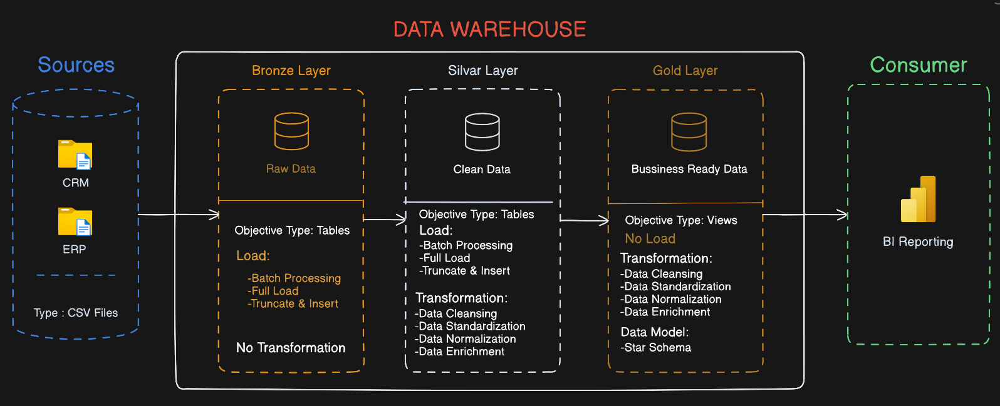
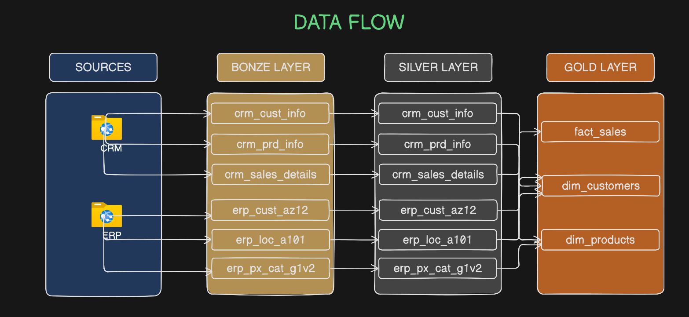
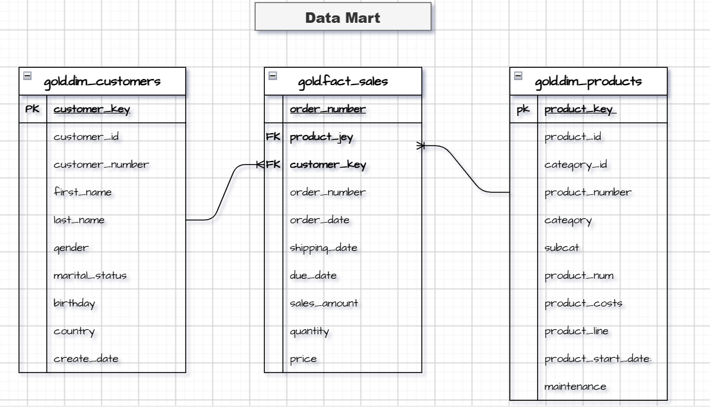

# 📊 Consolidate Sales Data — Data Warehouse Project

## 📌 Project Overview

This project is an end-to-end **Data Warehouse and ETL pipeline** built to consolidate sales data from multiple source systems into a centralized and analytics-ready data warehouse.
                                                                                                                                
The project integrates data from two different source systems:

- **CRM** 
- **ERP** 

The main objective is to transform raw source data into clean, structured, and business-ready information that can be used for reporting and analytical purposes.

This project was developed as a practical application of **SQL, ETL, Data Warehousing, Data Modeling, and Medallion Architecture concepts**.

---

## 🎯 Project Objectives

- Build a centralized Data Warehouse for sales data.
- Integrate data from CRM and ERP source systems.
- Apply an ETL process to extract, transform, and load data.
- Implement a **Medallion Architecture** using Bronze, Silver, and Gold layers.
- Clean and standardize raw source data.
- Create a dimensional data model for analytics.
- Build a Gold-layer Data Mart using a **Star Schema**.
- Apply SQL Server features and best practices throughout the pipeline.

---

# 🏗️ Data Architecture

The project follows the **Medallion Architecture**, divided into three main layers:

### 🥉 Bronze Layer — Raw Data

The Bronze layer contains the data as it is received from the source systems.

Data is loaded from CSV files with minimal transformations.

**Sources:**

- CRM CSV files
- ERP CSV files

The purpose of this layer is to preserve the original source data and provide a reliable landing zone for further processing.

### 🥈 Silver Layer — Cleaned & Transformed Data

The Silver layer contains cleaned and standardized data.

Transformations include:

- Removing unwanted spaces
- Handling NULL values
- Data type conversions
- Standardizing formats
- Handling invalid or inconsistent values
- Applying business rules

### 🥇 Gold Layer — Business-Ready Data

The Gold layer contains the final business-ready data model.

It is designed for analytical queries and reporting using a **Star Schema**.

The Gold layer contains:

- **Fact tables** — Business events and measurable metrics
- **Dimension tables** — Descriptive information used to analyze facts

---

## 🏛️ Data Architecture Diagram



---

# 🔄 Data Flow


---

# 🏛️ Data Mart


```text
                    SOURCE SYSTEMS
                 ┌──────────────────┐
                 │                  │
            CRM CSV Files      ERP CSV Files
                 │                  │
                 └────────┬─────────┘
                          │
                          ▼
                    🥉 BRONZE
                     Raw Data
                          │
                          ▼
                    🥈 SILVER
               Cleaned & Transformed
                          │
                          ▼
                     🥇 GOLD
                Business-Ready Data
                          │
                          ▼
                   SALES DATA MART
                          │
                          ▼
                Analytics & Reporting